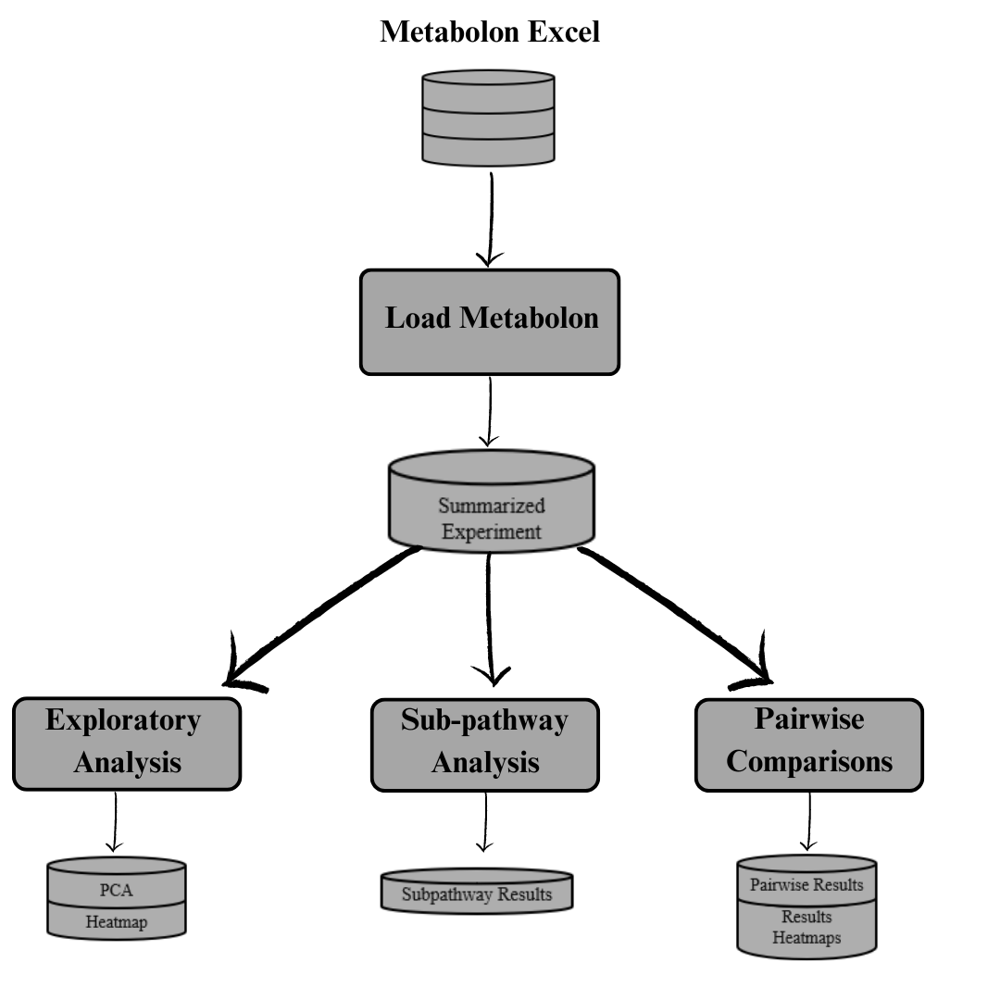
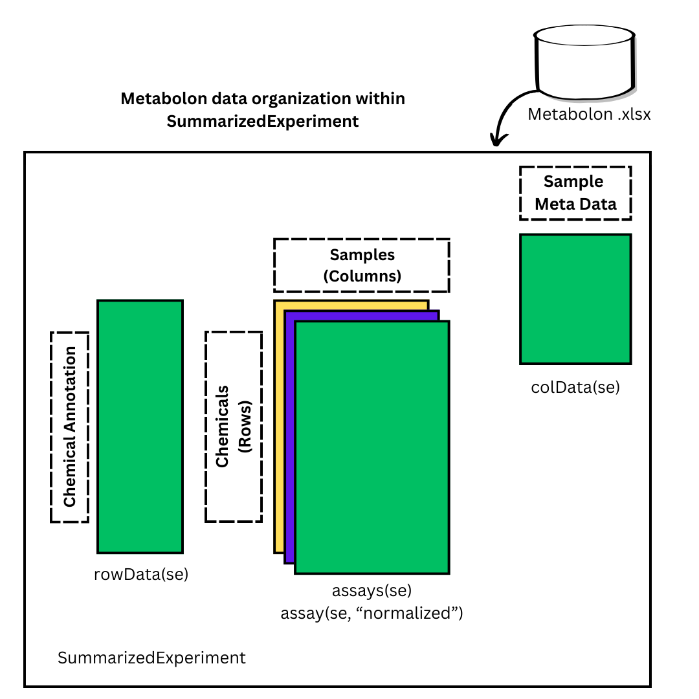

```{r setup, include=FALSE}
knitr::opts_chunk$set(echo = FALSE, warning = FALSE, message = FALSE)
library(plotly)
library(ggplot2)
library(palmerpenguins)
library(kableExtra)
```

# Introduction

Targeted metabolomics assays quantify a set of predefined small molecules called metabolites. Assays like  Matabolon Inc, classify each metabolite within sub pathways and super pathways based on its biological function. Depending on the goal of an experiment, the number of metabolites measured can range in size from 100s to thousands of metabolites. Metabolon Inc. utilizes a proprietary pipeline for preprocessing, exploratory analysis, and statistical analysis to provide customers with raw data, batch-corrected data, normalized data, and analysis results.   

While proprietary data analysis workflows can provide researchers with valuable results, they often do not follow the F.A.I.R guiding principles for reproducible research, which extends to workflows and pipelines (Wilkinson et al. and Goble et al. 2022). In particular, proprietary pipelines are not reusable or allow researchers to replicate the results. Additionally, proprietary workflows are limited to the types of analysis they can do, with little flexibility to make data-driven analysis decisions. Alternatively, utilizing open source software R to build analysis workflows and distribute them through centralized repositories like the Comprehensive R Archive Network (CRAN) or Bioconductor makes it possible to reuse workflows for secondary analysis and contributes to reproducible research. 

For R, there are several packages available for analyzing targeted metabolomics data. Packages like structToolbox and MetaboloAnalysistR provide open source tools for preprocessing, batch correction, and analysis of targeted metabolomic data (cite Metaboanalyst and structToolbox). However, these tools only provide functionality for hypothesis testing at the metabolite level and do not support hypothesis testing at the sub-pathway level. When hypothesis testing at the sub-pathway is of interest, we can independently test each metabolite and then combine the values within each sub-pathway using the combined Fisher probability test (cite combined Fisher prob). While the method has been leveraged in several experiments, to the best of our knowledge, there is not an R package that implements this method for sub-pathway testing. 

In this article, we introduce and demonstrate the MetabolomicsPipeline R package. This package provides analysis tools for target metabolomic data from Metabolon, which can be broken into three categories (figure 1):

* Exploratory analysis

* Sub pathway analysis

* Metabolite pairwise comparisons

* line plots and boxplots


```{r Workflow, out.width = "100%", out.height = "30%", fig.cap = "Figure 1. MetabolomicsPipeline workflow"}

```

The MetabolomicsPipeline package utilizes SummarizedExperiment to organize targeted metabolomic data into a common data structue to allow  for easy integration into prexisting geneomic workflows. The package also produces interactive graphs to easily sort through results. Uses can also leverage the tools within the metabolomicsPipeline package through an R shiny app. 
The remainder of this paper will be organized as follows. Section 2 will cover the package design and structure, including mathematical details and algorithm information. Section 3 will demonstrate the package on a case study using targeted metabolomic data from Metabolon. 


# Package Design
Targeted metabolomic experiments contains several different data sets about the experiment.
The metabolimic profiles for each sample is contained in a metabolite by sample data. There
may be multiple versions of the data including the raw peak data, batch corrected data, or
the normalized/standardized peak data. We also have chemical annotation data which contains 
information about each of the metabolites that are included in the assay. This information includes
the subpathway and super pathway for each metabolite, the metabolite id, and the alias for each metabolite. 
Additionally, we have the sample metadata which contains information about each sample include which of the 
experiment groups each sample belongs to. Metabolon Inc. includes all of this information in a single .xlsx
file. 

SummarizedExpirment allows reseachers to store rectangular data, which is common to 
genomic research, in an organized fashion. When analyzing assays with data about 
the rows/features and metadata about the samples/columns, storing data in a summarizedExperiment
can make it easier to access. This easy utility of the SumarizedExperiment makes it a widely used 
data structure an many genomic pipelines like ... . In figure 2, we show how targeted metabolomic
data is organized inside a SummarizedExperiment object. We provide a wrapper function which can 
automatically load Metabolon INC data from the .xlsx file provided by Metabolon into a SummarizedExperiment. 


```{r SEOrganization, out.width = "100%", out.height = "30%", fig.cap = "Figure 2. Organization of Metabolon Inc data into a SummarizedExperiment"}

```

Once the data is loaded into a summarized experiment, the types of analysis we can 
do can be categorized into four main categories descibed in figure 1. In the following 
subsections we describe the details behind the exploratory analsysis, subpathway analysis, metabolite
analysis and the box plot and line plot categories. 

## Exploratory analysis
The MetabolomicsPipeline package provide tools for visualiztion which has overlap with a few preexisting 
pipeline lines. In the exploratory analysis, we include PCA and heatmap visualizations which
allow us to graphically display sources of variation within the assay data. 

During the exploratory analysis stages an analyst may want to inspect sources of variation which 
may or may not be part of the experimental design. This step is crucial for thinking about how
we will modeling the data in a downsteam step. Sources of variation could be biological or technical
and how to proceed can vary from analyst to analyst. One of the primary tools for accessing sources
of variation in high dimensional data is principal component analysis (PCA). The first two principal 
components explain the most amount of variation in the data and can visualize sources
of variation by plotting each sample using the first two principal components and coloring by a factor 
of interest. In the context of metaboloimic data, samples that are closer together, have more similar 
metabolmic profiles. If we see clusters of samples that correspond to a factor in our data, then we can say 
that factor accounts for variation in the data. Depending on the factor we are looking at, we may want 
to make upstreams adjustments in the analsysis (for example batch correction), stratify the down stream
analsis, or if the factor we are looking at is part of the experimental design then we may carry on with the
experiment as planned. Researchers can utilize the function metabolite_pca to calculate the principal components
and graph the first two PCs with a single function. 

Another way to visualize the variation in high dimensional data is through the use of heatmaps. Within the MetabolomicsPiepline
package analysts can create heatmaps which show how the metabolites are changing across experimental conditions. Due to the high number
of metabolites in a given experiment, we filter metabolites based on there average standardized peak values. To control the order of the 
columns of the heatmap, additional arguments to the arrange function from tidyr can be passed to the metabololite_heatmap function. 

## Subpathway analysis
Targeted metabolomic assays quantify predefined chemical compounds called metabolites. Therefore, the
data being analyzed contains the amount of each chemical compound in each sample, where 
each sample is a replicate of some experimental condition. Each of the metabolites is classified into predetermined
sub pathways and super pathways. These classification are based on the specific biological function of the 
metabolite. 

Univariate analysis of variance (ANOVA) is commonly used to test if a significant amount of variance for each metabolite is explained by the
experimental conditions. While this is effective for independently testing each metabolite, it does not allow us to test hypothesis at the 
sub pathway level where each sub pathway contains one or more metabolites. To accomplish this, for each sub pathway, we can combine the results
for each independently tested metabolite within the sub pathway using the combined
fisher p-value method. To explain the details of this method, we will first explain the modeling 
procedure at the metabolite level and then explain how the results are combined. 

For each metabolite, we consider experimental designs with a block and treatment
effects. (disscuss what types of experiment designs this includes). We use nested 
ANOVA modeling using three different models for each metabolite. 

1.) Interaction: $metabolite = Treatment Group + block + Treatment*block$

2.) Parallel: $metabolite = Treatment Group + block$

3.) Single: $metbabolite= Treatment$

In the interaction model, we are testing for a significant interaction between
the treatment and block variables. Therefore, we only consider the pvalue for the 
interaction term. The parallel model considers the trantment and block variables without
the interaction term and is testing to see if there is a significant amount of variance for 
the metabolite accross the different levels of the block variable. Therefore, we are only considering the pvalue
pertaining to the block variable. The final model is the single model which tests the treatment variable. 

Once we have the pvalues for each model, we can then combine the pvalues from each 
model using the combined fisher probability method. We will test at the subpathway level by combining the p-values for each
metabolite within the subpathway for each model. We use a combination
function given by $\tilde{X}$ which combines the pvalues, resulting in a
chi-squared test statistic.

$$
\tilde{X} = -2\sum_{i=1}^k ln(p_i)
$$
where $k$ is the number of metabolites in the subpathway. We can
get a p-value from $P(X \geq\tilde{X})$, knowing that
$\tilde{X}\sim \chi^2_{2k}$. You will notice that smaller p-values will
lead to a larger $\tilde{X}$. 


<<algorithm details>>

Using the MetabolomicsPipeline package, the subpathway analysis can be implemented
using the subpathway_analysis function which provides the pvalues for each model 
at the metabolite level and the sub pathway level. The algorithmic details are explained in figure 3. 
The analysis can also be stratified by other variables. 
The MetabolomicsPipeline package also provides ways to summarize the sub pathway analysis results 
including

* Significant sub pathways by model (subpath_by_model)

* Proportion of significant sub pathways within super pathways (subpath_within_superpath)

* Metabolite results within sub pathways (met_within_sub)


## Metabolite analysis


## Box plots and heatmaps


## Shiny App


# Case Study


# Summary

Some packages on interactive graphics include \CRANpkg{plotly} [@plotly] that interfaces with Javascript for web-based interactive graphics, \CRANpkg{crosstalk} [@crosstalk] that specializes cross-linking elements across individual graphics.  The recent R Journal paper \CRANpkg{tsibbletalk} [@RJ-2021-050] provides a good example of including interactive graphics into an article for the journal. It has both a set of linked plots, and also an animated gif example, illustrating linking between time series plots and feature summaries.

# Customizing tooltip design with \pkg{ToOoOlTiPs}

\pkg{ToOoOlTiPs} is a packages for customizing tooltips in interactive graphics, it features these possibilities.

# A gallery of tooltips examples

The \CRANpkg{palmerpenguins} data [@palmerpenguins]  features three penguin species which has a lovely illustration by Alison Horst in Figure \@ref(fig:penguins-alison). 

```{r penguins-alison, out.width = "100%", out.height = "30%", fig.cap = "Artwork by \\@allison\\_horst", fig.alt="A picture of three different penguins with their species: Chinstrap, Gentoo, and Adelie. "}

```

Table `r knitr::asis_output(ifelse(knitr::is_html_output(), '\\@ref(tab:penguins-tab-interactive)', '\\@ref(tab:penguins-tab-static)'))` prints at the first few rows of the `penguins` data:

```{r penguins-tab-interactive, eval = knitr::is_html_output(), layout = "l-body-outset"}
knitr::kable(head(penguins), format = "html", caption = "A basic table")
```

```{r penguins-tab-static, eval = knitr::is_latex_output()}
knitr::kable(head(penguins), format = "latex", caption = "A basic table") %>% 
  kableExtra::kable_styling(font_size = 7)
```   

Figure `r knitr::asis_output(ifelse(knitr::is_html_output(), '\\@ref(fig:penguins-plotly)', '\\@ref(fig:penguins-ggplot)'))` shows an `r ifelse(knitr::is_html_output(), 'interactive', '')` plot of the penguins data, made using the `r knitr::asis_output(ifelse(knitr::is_html_output(), '\\CRANpkg{plotly}', '\\CRANpkg{ggplot2}'))` package. 

```{r penguins-plotly, echo = TRUE, fig.height = 5, fig.cap="A basic interactive plot made with the plotly package on palmer penguin data. Three species of penguins are plotted with bill depth on the x-axis and bill length on the y-axis. When hovering on a point, a tooltip will show the exact value of the bill depth and length for that point, along with the species name.", include=knitr::is_html_output(), eval=knitr::is_html_output(), fig.alt = "A scatterplot of bill length against bill depth, both measured in millimetre. The three species are shown in different colours and loosely forms three clusters. Adelie has small bill length and large bill depth, Gentoo has small bill depth but large bill length, and Chinstrap has relatively large bill depth and bill length."}
p <- penguins %>% 
  ggplot(aes(x = bill_depth_mm, y = bill_length_mm, 
             color = species)) + 
  geom_point()
ggplotly(p)
```

```{r penguins-ggplot, echo = TRUE, fig.height = 5, fig.cap="A basic non-interactive plot made with the ggplot2 package on palmer penguin data. Three species of penguins are plotted with bill depth on the x-axis and bill length on the y-axis. Visit the online article to access the interactive version made with the plotly package.", include=knitr::is_latex_output(), eval=knitr::is_latex_output()}
penguins %>% 
  ggplot(aes(x = bill_depth_mm, y = bill_length_mm, 
             color = species)) + 
  geom_point()
```

# Summary

We have displayed various tooltips that are available in the package \pkg{ToOoOlTiPs}. 
